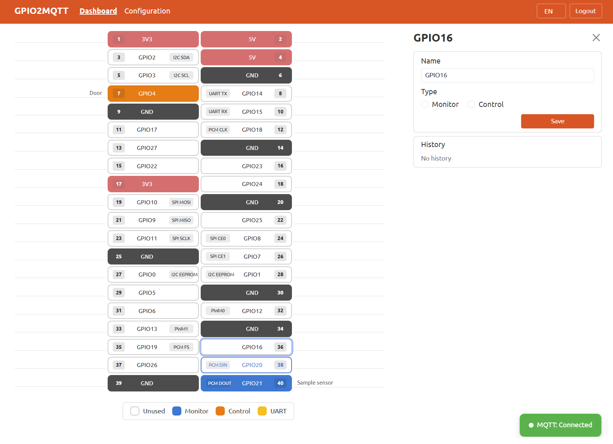

# GPIO2MQTT

Turn your Raspberry Pi into an alarm controller, gate opener, or any GPIO/UART-based device manager. GPIO2MQTT provides a simple web interface to monitor and control GPIO pins, with full MQTT integration for use with home automation systems like Home Assistant, Zigbee2MQTT, or standalone.

## Features

- **GPIO Monitoring** - Real-time monitoring of input pins (door sensors, motion detectors, etc.) with state history
- **GPIO Control** - Toggle output pins (relays, LEDs, etc.) with optional timed duration
- **MQTT Integration** - Publish/subscribe GPIO states to any MQTT broker
- **UART Support** - Run custom scripts for serial devices (distance sensors, displays, etc.)
- **Interactive Dashboard** - Visual Raspberry Pi pin layout with live state updates via SSE
- **JWT Authentication** - Token-based auth with auto-refresh, cross-tab logout, and brute-force protection
- **No Database** - Configuration stored in a single `config.json` file

## Screenshot



## Requirements

- Raspberry Pi (tested on RPi 4, Raspberry Pi OS, December 2025)
- Node.js 20.x, 22.x, or 24.x
- libgpiod (`gpiod` package)

## Installation

```bash
# Install Node.js (LTS) and system dependencies
sudo apt-get install -y curl
sudo curl -fsSL https://deb.nodesource.com/setup_lts.x | sudo -E bash -
sudo apt-get install -y nodejs git make g++ gcc libsystemd-dev

# Verify Node.js version
node --version  # Should output v20.x, v22.x, or v24.x

# Install libgpiod
sudo apt update
sudo apt install -y gpiod

# Clone and install
git clone https://github.com/rograf/gpio2mqtt.git
cd gpio2mqtt
npm install

# Start the application
npm start
```

The web interface will be available at `http://<your-pi-ip>:3521`.

Default login password: `admin`

## Configuration

All configuration is stored in `config.json`. The file is created automatically on first run with sensible defaults.

### Example `config.json`

```json
{
  "mqtt": {
    "broker": "mqtt://192.168.1.2:1883",
    "topic": "gpio2mqtt",
    "username": "",
    "password": ""
  },
  "gpio": {
    "monitor": [
      { "gpio": 21, "name": "Door sensor" }
    ],
    "control": [
      { "gpio": 4, "name": "Main relay" }
    ]
  },
  "uart": {
    "name": "Distance sensor",
    "intervalMinutes": 5
  },
  "language": "en",
  "gpioBackend": "gpiod-v2",
  "port": 3521,
  "auth": {
    "password": "admin",
    "accessTokenDays": 14,
    "tokenRefreshDays": 1,
    "maxFailedAttempts": 10,
    "failedAttemptWindowSeconds": 60,
    "blockDurationMinutes": 10
  }
}
```

### Configuration Reference

| Key | Default | Description |
|-----|---------|-------------|
| `mqtt.broker` | — | MQTT broker URL (e.g. `mqtt://192.168.1.2:1883`) |
| `mqtt.topic` | `gpio2mqtt` | Base MQTT topic |
| `mqtt.username` | `""` | MQTT broker username |
| `mqtt.password` | `""` | MQTT broker password |
| `gpio.monitor` | `[]` | Array of GPIO pins to monitor (inputs) |
| `gpio.control` | `[]` | Array of GPIO pins to control (outputs) |
| `uart.name` | — | Display name for the UART device |
| `uart.intervalMinutes` | `0` | UART script execution interval (0 = disabled) |
| `language` | `en` | UI language (`en`, `pl`) |
| `gpioBackend` | `gpiod-v2` | GPIO backend: `gpiod-v2`, `gpiod-v1`, or `fake` |
| `port` | `3521` | Web server port |
| `auth.password` | `admin` | Login password |
| `auth.accessTokenDays` | `14` | JWT token lifetime (days) |
| `auth.tokenRefreshDays` | `1` | Auto-refresh token after this many days of use |
| `auth.maxFailedAttempts` | `10` | Failed login attempts before IP block |
| `auth.failedAttemptWindowSeconds` | `60` | Time window for counting failed attempts |
| `auth.blockDurationMinutes` | `10` | IP block duration after exceeding failed attempts |
| `auth.secret` | `********` | Auto-generated on first run |

### GPIO Backends

| Backend | Description |
|---------|-------------|
| `gpiod-v2` | For newer Raspberry Pi OS (libgpiod v2). Uses interrupt-based monitoring via `gpiomon`. **Recommended.** |
| `gpiod-v1` | For older Raspberry Pi OS (libgpiod v1). Uses polling every 50ms. |
| `fake` | Simulated GPIO for development/testing. No real hardware required. |

## UART

UART allows you to run custom scripts for serial devices. Create a `uart.js` file in the project root:

```javascript
module.exports = function uart() {
  return new Promise((resolve, reject) => {
    // Your serial communication logic here
    // Return any JSON-serializable data
    resolve({ distance: 100 });
  });
};
```

The script runs at the interval defined in `uart.intervalMinutes`. Results are displayed in the dashboard and published via MQTT.

## MQTT Topics

All topics use the base prefix defined in `mqtt.topic` (default: `gpio2mqtt`).

### Monitor pins (publish)

**Topic:** `gpio2mqtt/GPIO{n}`

Published automatically when a monitored pin changes state (with 500ms debounce).

```json
{ "connected": true }
```

- `connected: true` — pin is connected to ground (e.g. door closed, sensor triggered)
- `connected: false` — pin is disconnected from ground (e.g. door open)

Initial states are also published when the MQTT broker connection is established.

### Control pins (publish)

**Topic:** `gpio2mqtt/GPIO{n}`

Published when a control pin state changes (via web UI or MQTT command).

```json
{ "power": true }
```

- `power: true` — output is ON (high)
- `power: false` — output is OFF (low)

### Control pins (subscribe)

**Topic:** `gpio2mqtt/GPIO{n}/set`

Send commands to control output pins. The application subscribes to these topics on startup.

```json
{ "power": true, "duration": 0 }
```

| Field | Type | Required | Description |
|-------|------|----------|-------------|
| `power` | `true` / `false` / `null` | Yes | `true` = turn ON, `false` = turn OFF, `null` = toggle |
| `duration` | number | No | Auto-revert after N milliseconds (0 = permanent, default) |

**Examples:**

```json
// Turn relay ON
{ "power": true }

// Turn relay ON for 5 seconds, then OFF
{ "power": true, "duration": 5000 }

// Toggle current state
{ "power": null }
```

### UART (publish)

**Topic:** `gpio2mqtt/uart`

Published at the configured interval with the result of the `uart.js` script.

```json
// Success — whatever your uart.js returns
{ "distance": 100 }

// Error
{ "error": "error message" }
```

## Project Structure

```
gpio2mqtt/
├── index.js                  # Entry point
├── config.json               # Configuration (auto-generated)
├── lib/
│   ├── auth.js               # JWT authentication & rate limiting
│   ├── config.js             # Config loading & defaults
│   ├── gpio.js               # GPIO manager
│   ├── gpio-backend-v1.js    # libgpiod v1 backend
│   ├── gpio-backend-v2.js    # libgpiod v2 backend
│   ├── gpio-backend-fake.js  # Simulated backend
│   ├── mqtt.js               # MQTT connection
│   ├── routes.js             # Express routes & API
│   └── uart.js               # UART scheduler
├── views/
│   ├── layouts/main.hbs      # Main layout
│   ├── dashboard.hbs         # GPIO dashboard
│   ├── config.hbs            # Settings page
│   └── login.hbs             # Login page
└── assets/
    └── i18n/                 # Language files (en.json, pl.json)
```

## Running as a Service (PM2)

To run GPIO2MQTT as a PM2 process:

```bash
# Install PM2 globally
sudo npm install -g pm2

# Start the application
cd /home/pi/gpio2mqtt
pm2 start index.js --name gpio2mqtt

# Enable auto-start on boot
pm2 startup
pm2 save
```

Useful PM2 commands:

```bash
pm2 status              # Check process status
pm2 logs gpio2mqtt      # View logs
pm2 restart gpio2mqtt   # Restart the app
pm2 stop gpio2mqtt      # Stop the app
```

## Security Notes

- Change the default password immediately after first login
- JWT tokens are stored in httpOnly cookies (valid for 14 days, auto-refreshed server-side after 1 day)
- Sessions survive server restarts (stateless JWT, no server-side token storage)
- Brute-force protection blocks IPs after repeated failed login attempts
- The `auth.secret` is auto-generated and stored in `config.json` — keep this file secure

## Author

**Rafal Rogulski** — [devrogulski+gpio2mqtt@gmail.com](mailto:devrogulski+gpio2mqtt@gmail.com)

This project was built with the assistance of AI, supervised and directed by the author.

## Contributing

Contributions are welcome! Feel free to open issues or submit pull requests.

## License

This project is licensed under the [GNU General Public License v3.0](https://www.gnu.org/licenses/gpl-3.0.html).

You are free to use, modify, and distribute this software, provided that derivative works are also licensed under GPLv3 and proper attribution is given.
